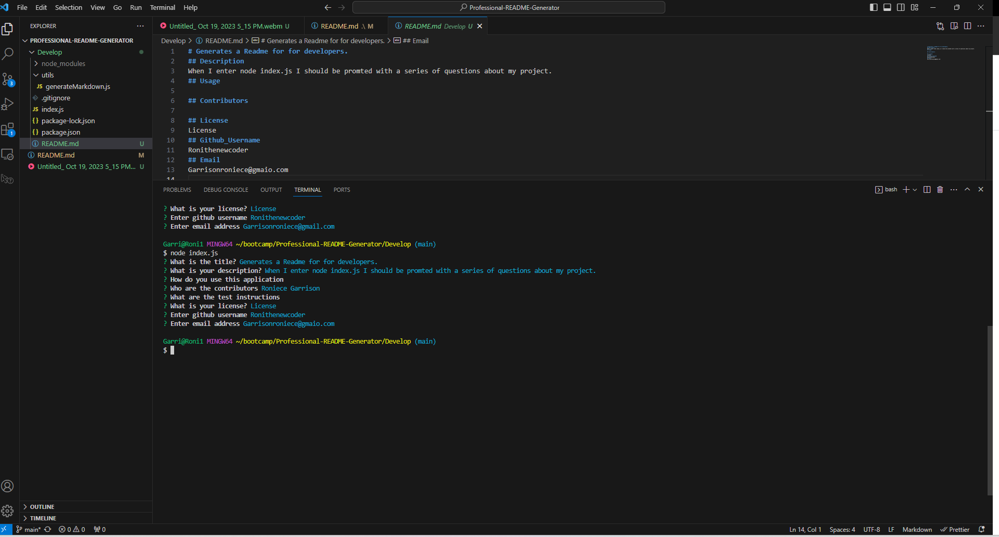

# Professional Readme Generator

## User Story
AS A developer
I WANT a README generator
SO THAT I can quickly create a professional README for a new project

## Usage
When I enter node index.js I should be promted with a series of questions about my project.

## Resources
Tutor - Phillip Loy

## Demonstration Video
<video src="Untitled%20video%20-%20Made%20with%20Clipchamp.mp4" controls title="Readme"></video> 
https://clipchamp.com/watch/dqX5qEkyhIc

## Picture

